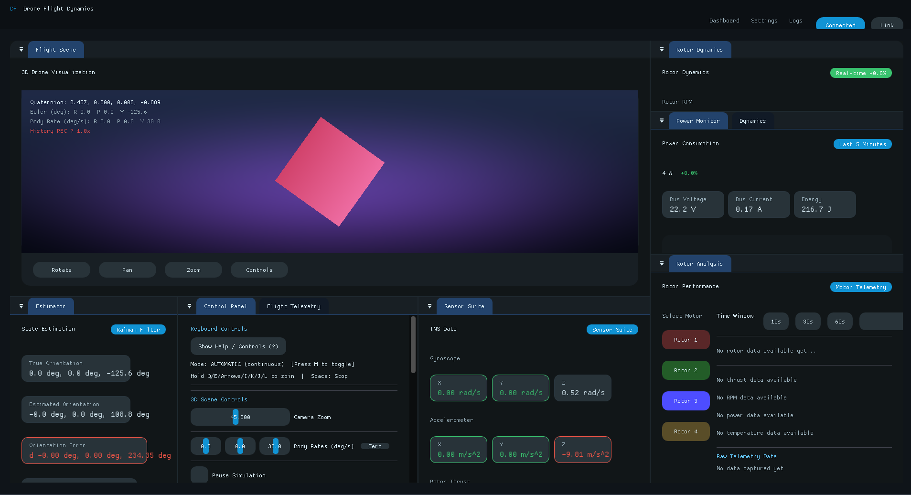
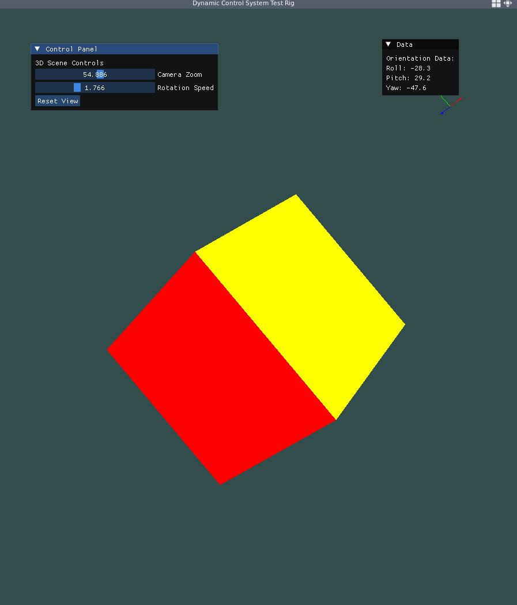
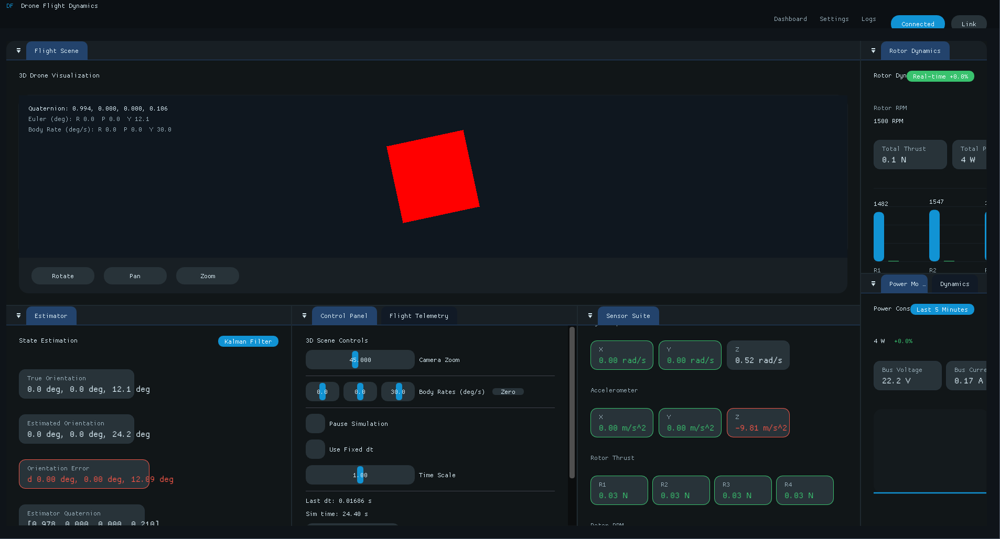

# AeroDynControlRig

[](https://github.com/antshiv/AeroDynControlRig/actions/workflows/doxygen.yml)
[](https://antshiv.github.io/AeroDynControlRig/)

Desktop visualization and testbed for the flight-control stack. The rig stitches together OpenGL rendering, GLFW window/input handling, and Dear ImGui dashboards so we can exercise quaternion math today and layer in PID control, dynamic models, state estimation, and the full INS loop tomorrow.

📚 **[View Documentation](https://antshiv.github.io/AeroDynControlRig/)** - Complete system architecture with visual diagrams

## Overview

- **Purpose** – Provide a fast feedback loop for control-algorithm development: visualize attitude changes, tune controllers, and replay telemetry from the same interface.
- **Stack** – C++17, OpenGL 3.3, GLFW, Dear ImGui. External libraries (attitude math, estimators, controllers, dynamics, INS) live under `external/` as git submodules.
- **Architecture** – HMVC-inspired split: simulation modules update a shared `SimulationState`, renderers draw the scene, and ImGui panels expose controls/data.

## Directory Layout

- `external/` – Third-party and sibling libraries (currently `attitudeMathLibrary`; PID, dynamics, estimator, and INS modules will land here next).
- `imgui/` – Dear ImGui source and backend glue (kept vendor-clean; the app talks to it through thin wrappers in `src/gui`).
- `src/` – Application code (entry point, simulation modules, rendering, GUI panels). Refactors will pull the existing files into `app/`, `core/`, `modules/`, `render/`, and `gui/` namespaces.
- `shaders/` – GLSL programs for scene meshes, gizmos, and future HUD widgets.
- `assets/` – Static resources such as screenshots or fonts (`assets/ui_preview.png` shows the refreshed cockpit UI).
- `build/` – CMake build output (ignored by git).

## Getting Started

1. **Install deps** – CMake ≥ 3.20, a C++17 compiler, OpenGL 3.3 capable GPU/driver, and development headers for GLFW/GLAD (platform package names vary).
2. **Clone with submodules**
   ```bash
   git clone --recurse-submodules <repo-url>
   cd AeroDynControlRig
   ```
3. **Configure & build**
   ```bash
   cmake -S . -B build -DCMAKE_BUILD_TYPE=RelWithDebInfo
   cmake --build build
   ```
4. **Run**
   ```bash
   ./build/AeroDynControlRig
   ```

## Current Features

- **Quaternion Visualization** – Real-time 3D rotation with dual modes (AUTOMATIC for continuous drone simulation, MANUAL for discrete quaternion testing)
- **Real-Time Telemetry** – ImPlot-powered graphs for attitude angles, angular rates, and rotor dynamics with configurable time windows (5-120s)
- **Rotor Analysis Panel** – Per-motor telemetry with thrust/RPM/power/temperature plots, raw data tables, and CSV export
- **State Estimator Panel** – Complementary filter output with error tracking and attitude history visualization
- **Docking Workspace** – Fully customizable ImGui layout with control, telemetry, dynamics, rotor, sensor, power, and estimator panels
- **Axis Gizmo & Scene** – OpenGL 3.3 rendering with proper face culling and depth testing
- **In-App Documentation** – Keyboard controls help modal with mode-specific instructions

## Roadmap

1. Modularize the codebase (`src/app`, `src/core`, `src/modules`, `src/render`, `src/gui`) to mirror the HMVC layout.
2. Add modules for PID control (wrapping `controlSystems`), quad dynamics, state estimation, and INS orchestration.
3. Expand UI with tuning panels, telemetry plots, and scenario playback controls.
4. Hook in log replay and export to evaluate controllers against recorded flights.

## Long-Term Goals

- **Stage 0 – Core Visual Sandbox**  
  Animate rigid-body orientation from quaternions/Euler angles, provide camera/timestep controls, and validate math and rendering flow.
- **Stage 1 – Dynamics Explorer**  
  Load dynamic-model variants, drive them with step/sinusoid/chirp inputs, plot responses, and visualize poles/zeros while tuning parameters.
- **Stage 2 – Controller Workbench**  
  Introduce PID/LQR/MPC modules, expose gain tuning with commanded vs. actual plots, and display root locus or pole movement as controllers change.
- **Stage 3 – Estimation Diagnostics**  
  Feed noisy sensor data, plot estimator outputs vs. ground truth with residuals/covariances, and test fault scenarios (bias, dropout).
- **Stage 4 – INS Integration**  
  Close the full loop (reference → controller → dynamics → sensors → estimator → feedback), script scenarios, and monitor latency/saturation.
- **Stage 5 – High-Fidelity Simulation**  
  Render vehicles/obstacles, simulate disturbances (wind, payload shifts), support path-planning behaviours, and log or replay 3D missions.

## Ecosystem Map

AeroDynControlRig sits at the centre of a toolchain of shared modules and physical rigs:

- **Software Libraries**
  - [`attitudeMathLibrary/`](../attitudeMathLibrary) – quaternion/Euler/DCM utilities
  - [`controlSystems/`](../controlSystems) – PID, LQR, MPC primitives
  - [`stateEstimation/`](../stateEstimation) – complementary, Mahony, EKF filters
  - [`dynamic_models/`](../dynamic_models) – first-principles plants
  - [`inertial_navigation_system/`](../inertial_navigation_system) – wraps math + estimation + control into a flight loop
  - [`rotorDynamics/`](../rotorDynamics) – momentum/blade-element coefficients shared by `dynamic_models` and this simulator
- **Physical Rigs**
  - [`ThrustStand/`](../ThrustStand) – propulsion characterisation (thrust/torque curves feed the rotor models)
  - [`DroneTestRig/`](../DroneTestRig) – multi-axis mounting rig for hardware-in-the-loop control tests

All telemetry and coefficient data loop back into AeroDynControlRig for visualization and INS/controller tuning, keeping software and hardware in sync.

## UI Preview

### Latest UI (October 2025)


The current interface features a comprehensive docking layout with:
- **Flight Scene** (left) – 3D quaternion visualization with real-time orientation data
- **Control Panel** – Keyboard controls, rotation modes (AUTOMATIC/MANUAL), and simulation settings
- **Estimator Panel** – Kalman filter output with attitude/rate plots and error tracking
- **Sensor Suite** – IMU data (gyroscope, accelerometer, magnetometer) visualization
- **Rotor Analysis** (right) – Per-motor performance with color-coded selection, telemetry plots, and data export
- **Power Monitor** – Bus voltage, current, and energy consumption tracking
- **Flight Telemetry** – Additional system metrics and diagnostics

### Previous Iterations



The evolution shows progression from a basic control layout to a fully-featured flight dynamics workbench with real-time plotting, multi-panel telemetry, and professional styling.
